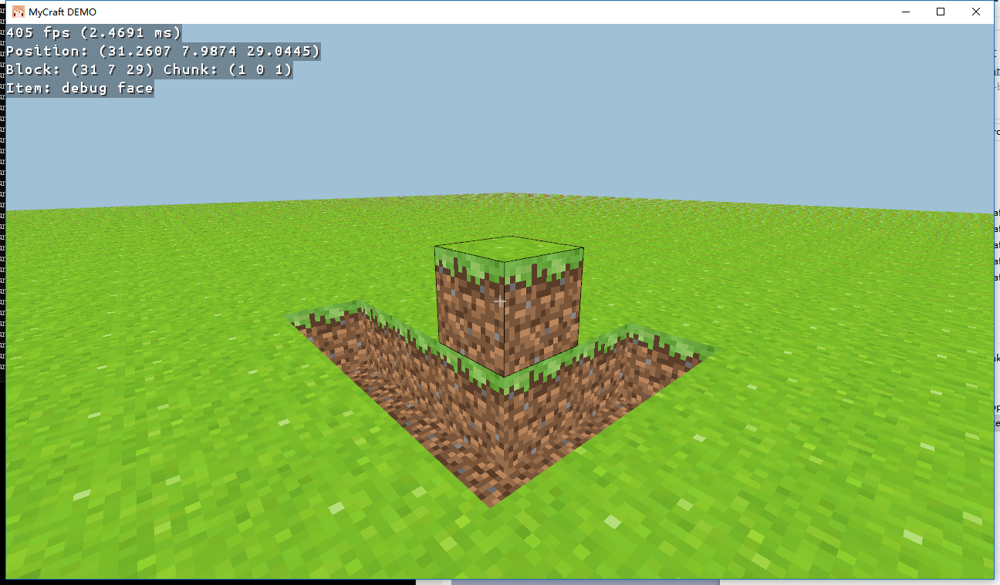

# My Craft DEMO

------

Little project to make a Minecraft-like game. Many fantastic features did not implemented. Only the basic and core features like voxel game engine, block designs, chunk meshing, collision detections and ray hit-test.

------

------

Build Config:

OS: Windows 10 RS3

IDE: Jetbrains Clion 2018.3.4

Compiler: msys64 Mingw GCC x86_64

Libs: GLFW, GLEW, LodePNG, pthread

-----

Actually if you wanna make this kind of game by yourself, my code is definitely irreverent. Check out and understand the concepts behind the articles below, this will help a lot.

http://www.opengl-tutorial.org/

https://learnopengl.com/

<https://0fps.net/2012/01/14/an-analysis-of-minecraft-like-engines/> 

<https://0fps.net/2012/06/30/meshing-in-a-minecraft-game/> 

<https://0fps.net/2013/07/09/texture-atlases-wrapping-and-mip-mapping/> 

<https://0fps.net/2015/01/07/collision-detection-part-1/> 

<https://0fps.net/2015/01/18/collision-detection-part-2/> 

<https://0fps.net/2015/01/23/collision-detection-part-3-benchmarks/> 

<http://playtechs.blogspot.co.uk/2007/03/raytracing-on-grid.html> 

